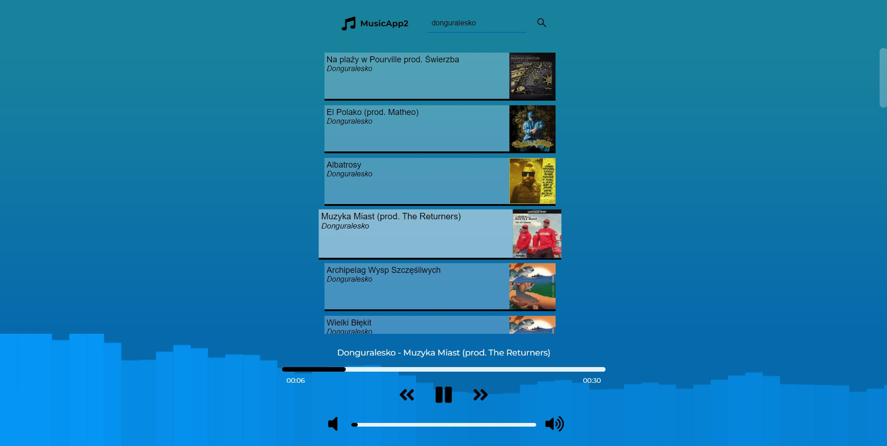

## MusicApp2

<a href="https://music-app2.vercel.app/">

</a>

## 🤔 About

Simple music player app built with React.js and free (and very limited) Deezer API. The app lets you search for your favourite music and play it. It also display cool song's frequency animation on canvas on supported browsers.

### Functionality:

- search for songs (it will fetch 25 of them),
- scroll down and click 'load more' to load more songs with given query,
- click on song to play it,
- play / pause song,
- play previous / next song,
- click on progress bar to change song's current time,
- click on volume bar to change volume level,

Sample screen:



## 💻 Run it locally

```bash

git clone https://github.com/PatrykBuniX/MusicApp2.git

yarn install

yarn dev
```

## 🚀 Live

https://music-app2.vercel.app/
